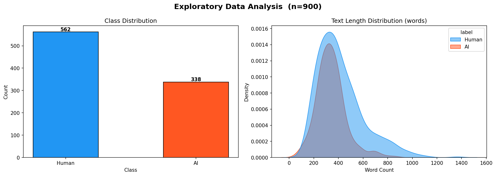
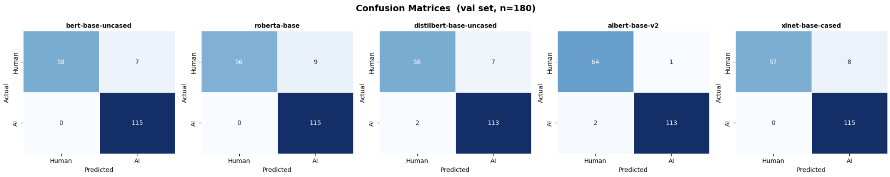
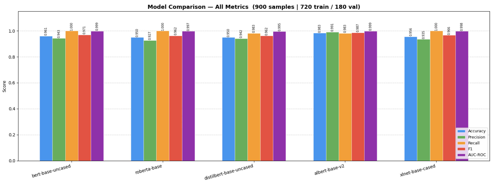
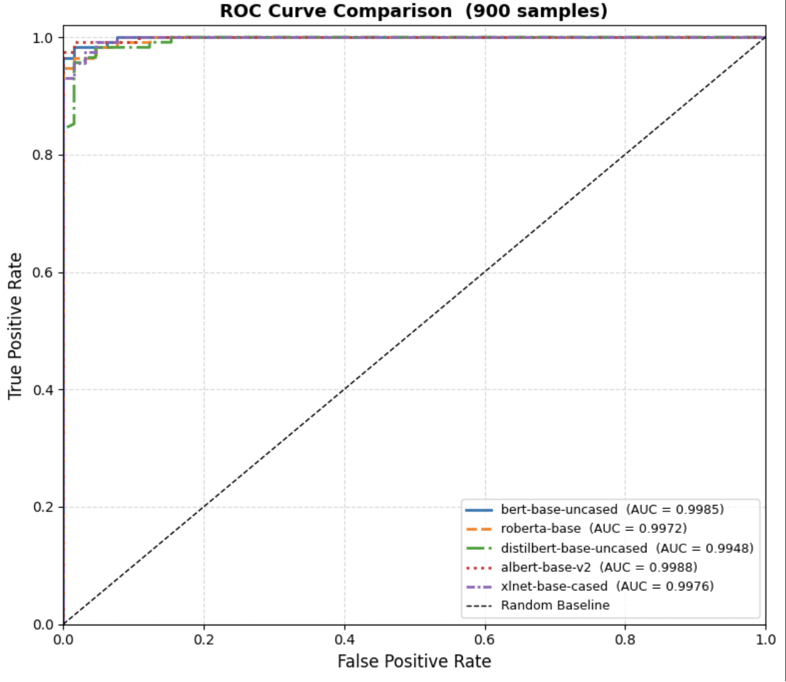
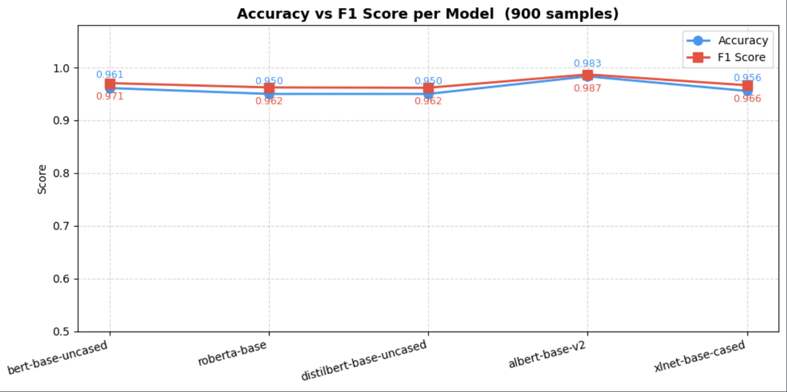

# 🤖 AI vs Human Text Classifier

> Fine-tuning and benchmarking 5 transformer models to detect AI-generated text


---

## 📌 Overview

This project fine-tunes and benchmarks **5 state-of-the-art transformer models** on a binary text classification task — distinguishing between **AI-generated** and **Human-written** text.

All models are trained and evaluated on the **same 900-sample dataset split** for a fair comparison. The best model (**ALBERT-base-v2**) achieved **98.3% accuracy** and **98.7% F1 score**.

---

## 📊 Dataset

| Property | Value |
|----------|-------|
| File | `AI_Human.csv` |
| Total Samples Used | 900 |
| Train / Val Split | 720 / 180 (80% / 20%) |
| Human-written (0) | 562 |
| AI-generated (1) | 338 |

> ⚠️ Dataset not included (1GB+). Download here: **[Download AI_Human.csv](#)** ← *(replace with your Google Drive link)*

---

## 🧠 Models Compared

| Model | Parameters | Type |
|-------|-----------|------|
| `bert-base-uncased` | 110M | Encoder |
| `roberta-base` | 125M | Encoder |
| `distilbert-base-uncased` | 66M | Distilled Encoder |
| `albert-base-v2` | 12M | Lite Encoder |
| `xlnet-base-cased` | 117M | Autoregressive |

---

## ⚙️ Training Configuration

| Parameter | Value |
|-----------|-------|
| Total Samples | 900 |
| Train / Val | 720 / 180 |
| Max Token Length | 128 |
| Epochs | 2 |
| Batch Size | 4 |
| Learning Rate | 2e-5 |
| Optimizer | AdamW |

---

## 📈 Results

| Rank | Model | Accuracy | Precision | Recall | F1 | AUC-ROC |
|------|-------|----------|-----------|--------|----|---------|
| 🥇 1 | albert-base-v2 | **0.9833** | **0.9910** | 0.9830 | **0.9870** | **0.9988** |
| 🥈 2 | bert-base-uncased | 0.9611 | 0.9430 | **1.0000** | 0.9710 | 0.9985 |
| 🥉 3 | xlnet-base-cased | 0.9556 | 0.9350 | **1.0000** | 0.9660 | 0.9976 |
| 4 | distilbert-base-uncased | 0.9500 | 0.9420 | 0.9830 | 0.9620 | 0.9948 |
| 5 | roberta-base | 0.9500 | 0.9270 | **1.0000** | 0.9620 | 0.9972 |

> 🏆 **Best Model: ALBERT-base-v2** — F1 = 0.9870 | AUC = 0.9988

---

## 📉 Visualizations

### EDA — Class Distribution & Text Length


---

### Confusion Matrices (val set, n=180)


| Model | True Human | False AI | False Human | True AI |
|-------|-----------|----------|-------------|---------|
| bert-base-uncased | 58 | 7 | 0 | 115 |
| roberta-base | 56 | 9 | 0 | 115 |
| distilbert-base-uncased | 58 | 7 | 2 | 113 |
| **albert-base-v2** | **64** | **1** | 2 | 113 |
| xlnet-base-cased | 57 | 8 | 0 | 115 |

---

### Model Comparison — All Metrics


---

### ROC Curve Comparison


All models achieve **AUC > 0.994** — excellent discrimination between AI and Human text.

---

### Accuracy vs F1 Score


---

## 📂 Project Structure

```
ai-vs-human-classifier/
│
├── classifier.py              # Main training & evaluation script
├── .gitignore
├── README.md
│
└── outputs/                   # Auto-generated after running
    ├── eda_plots.png
    ├── confusion_matrices.png
    ├── metrics_comparison.png
    ├── roc_curves.png
    └── accuracy_f1_line.png
```

---

## 🚀 Getting Started

### 1. Clone the repo
```bash
git clone https://github.com/Sarthak1711-hub/ai-vs-human-classifier.git
cd ai-vs-human-classifier
```

### 2. Create virtual environment
```bash
# Mac/Linux
python3 -m venv venv
source venv/bin/activate

# Windows
python -m venv venv
venv\Scripts\activate
```

### 3. Install dependencies
```bash
pip install torch transformers datasets scikit-learn matplotlib seaborn pandas
```

### 4. Add dataset
Download `AI_Human.csv` from the link above and place it in the project root.

### 5. Run
```bash
python classifier.py
```

---

## 🔑 Key Findings

- **ALBERT-base-v2** achieved the best performance despite having the fewest parameters (12M)
- **BERT, RoBERTa, and XLNet** achieved perfect recall (1.0000) — zero missed AI texts
- All 5 models achieved **AUC > 0.994**
- Strong results achievable with just **720 training samples**

---

## 🖥️ Requirements

- Python 3.10+
- PyTorch 2.0+
- HuggingFace Transformers 4.30+
- 8GB+ RAM recommended

---

## 📄 License

[MIT License](LICENSE)

---

## 👨‍💻 Author

**Sarthak Mandal** — [@Sarthak1711-hub](https://github.com/Sarthak1711-hub)

---

<p align="center">⭐ Star this repo if you found it helpful!</p>
